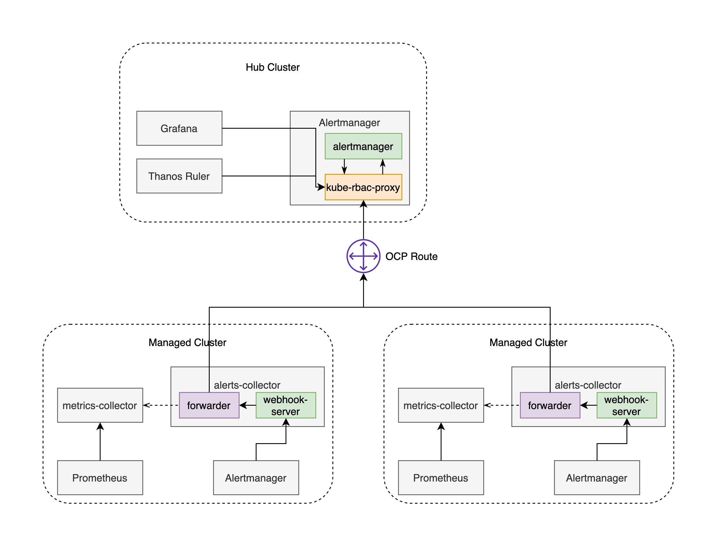

# Alerts-Collector

> NOTE: This project is alpha stage. Flags, configuration, behavior and design may change significantly in following releases.

The Alerts Collector implements a webhook server to receive alerts from OpenShift Alertmanager and performs an alert forward to upstream Alertmanager instances hosted by Red Hat Advanced Cluster Management for Kubernetes hub cluster.

# Why?

You may ask yourself, why not just forward alerts from downstream Alertmanager instances to upstream Alertmanager instances? Unfortunately, this feature has not been implemented by the community AFAIK, I raised [a question](https://groups.google.com/g/prometheus-users/c/vGzyovDF_c8) about that in the community mail list, no reponse till now. The second and more important reason is, we also want to forward all the metrics to upstream for the alerts received from downstream Alertmanagers, the metrics have to be extrated in a dedicated module, so that the metrics collector, for example, [Telemeter](https://github.com/openshift/telemeter) can scrape relevant metrics from downstream Prometheus instances.

# How does it work?

The Alerts Collector is composed of two components, a webhok server acts as receiver of downstream Alertmanager instances and an alert forwarder to post alerts to upstream Alertmanager instances. The forwarder creates an HTTP client for each upstream Alertmanager with configured security settings, on an incoming alert batch to the webhook server, the forwarder starts the loop of posting the alert batch to all the upstream Alertmanager. (TODO)Cache for the received alerts and customization for the forward policies will be supported in the following releases.



## How to use

> Note: Before you begin, you should have an [OCM(Open Cluster Management)](https://open-cluster-management.io/) with observibility stack enabled installed. If you have not done that, follow the [steps](https://github.com/open-cluster-management/deploy) to install OCM.

1. Check out the alerts-collector repository.

```
$ git clone git@github.com:morvencao/alerts-collector.git && cd alerts-collector
```

2. Build the alerts-collector image and push it to a public registry, such as quay.io:

```
$ make docker-build docker-push IMG=quay.io/<USERNAME>/alerts-collector:latest
```

> Note: The following steps have to be executed on each managed cluster and will be integrated into the [MCO operator](https://github.com/open-cluster-management/multicluster-observability-operator) so that they don't need to be executed manually.

3. Create the configmap named `alerts-collector-config` that contains the configurations for the upstream Alertmanager, [an example configuration](deploy/configmap.yaml) can be found in `deploy` directory, update it according to your configurations and apply it to the cluster:

```
$ kubectl -n open-cluster-management-addon-observability apply -f deploy/configmap.yaml
```

4. If you set `insecure_skip_verify` to `false` in the configuration created in the last step, then you need to create the configmap named `alertmanager-ca-bundle` that contains the CA(Certificate Authority) of the upstream Alertmanager:

```
$ kubectl -n open-cluster-management-addon-observability create configmap alertmanager-ca-bundle --from-file=service-ca.crt
```

5. Create the secret named `alerts-collector-k8s-token` that contains the k8s token with sufficient permission to access alert APIs of the upstream Alertmanager:

```
$ kubectl -n open-cluster-management-addon-observability create secret generic alerts-collector-k8s-token --from-literal=token=xxxxxxx
```

6. Update configurations for the downstream Alertmanager instances in managed clusters to send alerts to the alerts-collector:

```
$ cat << EOF > alertmanager.yaml
...
receivers:
...
- name: "AlertsCollector"
  webhook_configs:
  - url: "https://alerts-collector.open-cluster-management-addon-observability.svc:8443/webhook"
    http_config:
      tls_config:
        insecure_skip_verify: true
route:
  ...
  routes:
  ...
  - match:
      alertname: "foo"
    receiver: "AlertsCollector"
EOF
$ kubectl -n openshift-monitoring create secret generic alertmanager-main --from-file=alertmanager.yaml --dry-run -o yaml | kubectl apply -n openshift-monitoring -f -
```

7. Deploy the Alerts Collector deployment and service into the cluster and wait until the Alerts Collector pods are up and running:
```
$ kubectl -n open-cluster-management-addon-observability apply -f deploy/deployment.yaml
$ kubectl -n open-cluster-management-addon-observability apply -f deploy/service.yaml
```

8. Verify the alerts from the downstream AlertManager can be forwarded to the upstream AlertManager by create fake alerts in the downstream AlertManager and check it in the upstream AlertManager:

```
$ kubectl -n openshift-monitoring exec -it alertmanager-main-0 -c alertmanager -- bash
bash-4.4$ amtool alert add --alertmanager.url=http://127.0.0.1:9093 alertname=foo node=bar
bash-4.4$ amtool alert --alertmanager.url=http://127.0.0.1:9093
Alertname        Starts At                Summary
foo              2021-04-24 07:11:41 UTC
bash-4.4$ exit
exit
# kubectl -n open-cluster-management-observability exec -it observability-alertmanager-0 -c alertmanager -- bash
bash-4.4$ amtool alert --alertmanager.url=http://127.0.0.1:9093
Alertname                      Starts At                Summary                          State
foo                            2021-04-24 07:11:41 UTC                                   active
```

# Roadmap

PRs are more than welcome!

- Tests
